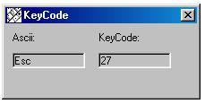



## keyCode

### Description

It replies the Ascii Code and the vbKEyCode of any Key by pressing. I had to make it at work to test somthing. It's really very simple. But perhaps you can use it...
 
### More Info
 

             |
---                |---
**Submitted On**   |2000-05-05 13:06:38
**By**             |[amaru](https://github.com/Planet-Source-Code/PSCIndex/blob/master/ByAuthor/amaru.md)
**Level**          |Beginner
**User Rating**    |4.0 (8 globes from 2 users)
**Compatibility**  |VB 5\.0, VB 6\.0
**Category**       |[Complete Applications](https://github.com/Planet-Source-Code/PSCIndex/blob/master/ByCategory/complete-applications__1-27.md)
**World**          |[Visual Basic](https://github.com/Planet-Source-Code/PSCIndex/blob/master/ByWorld/visual-basic.md)
**Archive File**   |[CODE\_UPLOAD5599582000\.zip](https://github.com/Planet-Source-Code/amaru-keycode__1-7950/archive/master.zip)

